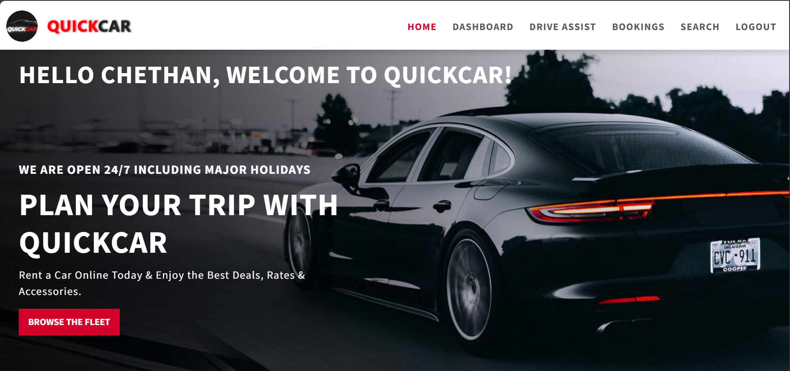
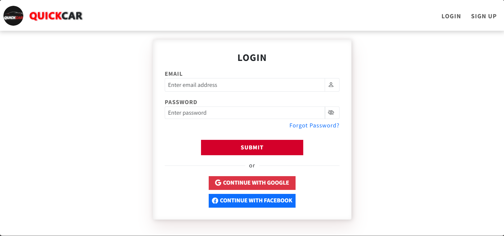
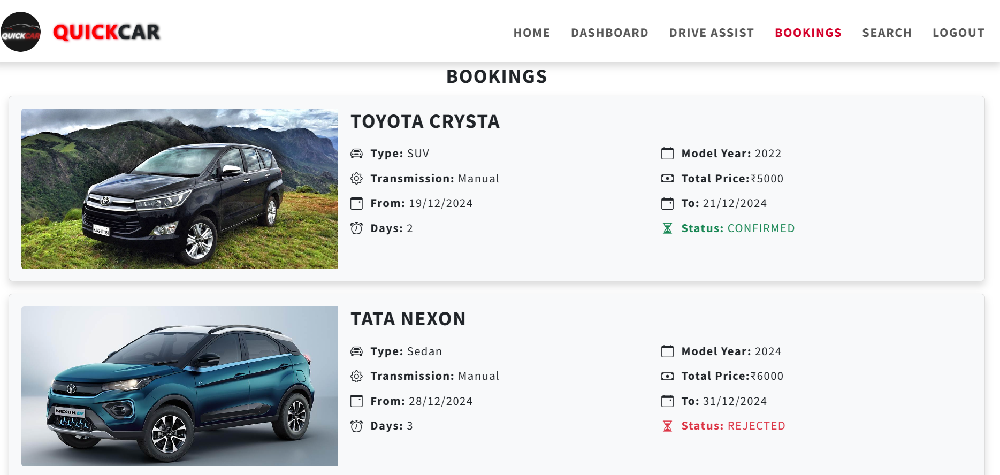
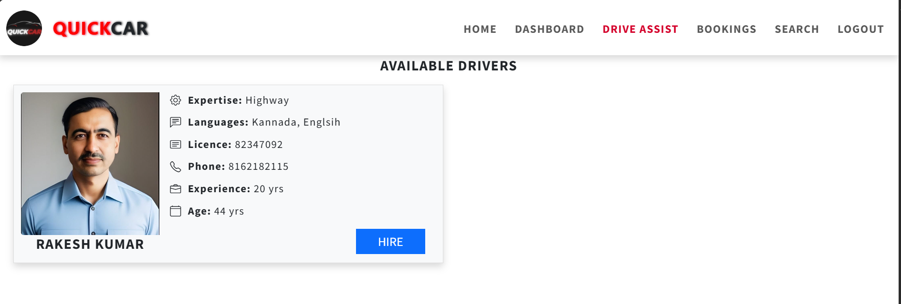
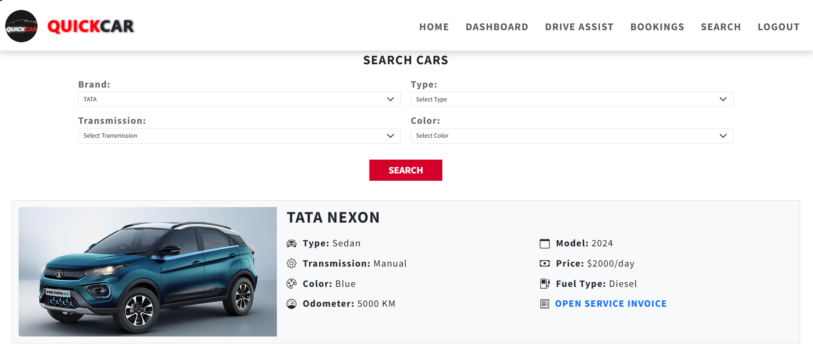
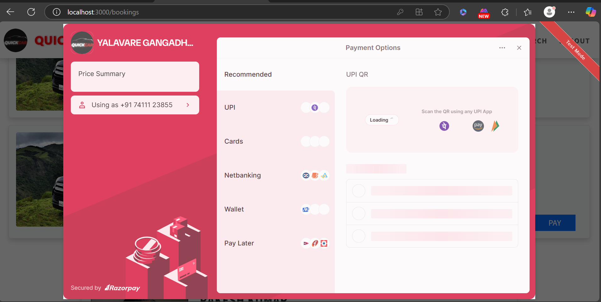
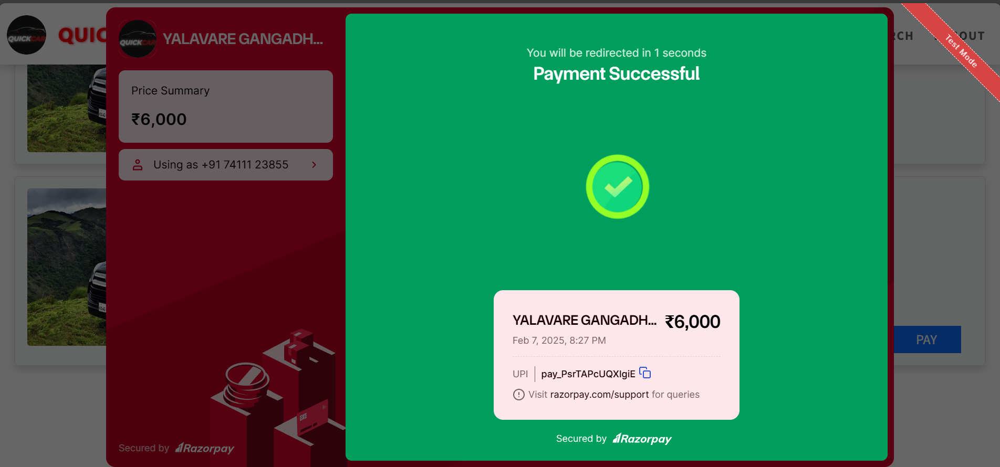
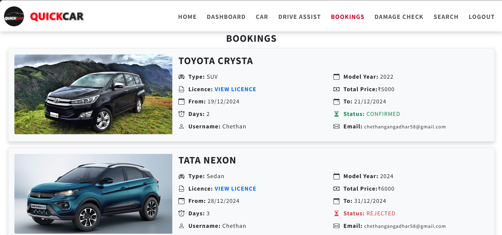

# QuickCar - A Car Rental System

QuickCar is a full-fledged car rental system built using **Spring Boot, React, and Bootstrap** with a **monolithic architecture**. The system allows users to rent cars seamlessly with role-based authentication, booking management, and a robust admin panel.

## Features

### **Authentication & User Roles**
- **User Roles:** Customer & Admin
- **JWT Authentication with Refresh Token Logic**
- **Google & Facebook Login Integration**
- **Forgot Password via OTP (Email-based Reset)**

### **Customer Features**
- **Home Page** with callback request option and user information
- **Car Booking System**
  - Select desired car
  - Choose rental dates
  - Upload driver's license (mandatory for customers)
  - Option to hire a driver (license not required)
- **Booking Management**
  - View all bookings
  - Cancel bookings (only if not approved by admin)
  - Make payments via **Razorpay** (if approved by admin)
- **Search & Filters**
  - Filter cars by **color, brand, transmission type, and fuel type**
- **Enhanced Customer Safety**
  - Display **odometer reading** and **last service invoice** of each car
- **Cloudinary Integration**
  - Upload images for **cars, driver's license, and driver profile photos**

### **Admin Features**
- **Car Management**
  - Add new cars
  - Update and delete cars
- **Driver Management**
  - Add, update, and delete drivers
- **Booking Management**
  - View all bookings
  - Approve or reject bookings
  - View customer details and uploaded documents (license, driver details, etc.)
- **Search & Filtering**
  - Search and filter bookings by user details
- **AI-based Damage Detection**
  - Uses **YOLO model** from **Ultralytics** (Flask backend)
  - Upload car images for **damage detection and marking**

## **Technology Stack**

### **Frontend:**
- React.js
- Bootstrap
- Axios for API calls

### **Backend:**
- Spring Boot
- Spring Security with JWT
- Hibernate (JPA)
- REST API
- Flask (for ML damage detection)

### **Database & Cloud Services:**
- MySQL (for storing user and booking data)
- Cloudinary (for image uploads)
- Razorpay (for payments)

## **Installation & Setup**

### **Backend Setup**
```bash
# Clone the repository
git clone https://github.com/Chethan-YG/QuickCar-A-Car-Rental-System-SpringBoot-React-BootStrap.git

# Navigate to the backend folder
cd QuickCar

# Build & Run Spring Boot application
mvn clean install
mvn spring-boot:run
```

### **Frontend Setup**
```bash
# Navigate to the frontend folder
cd quickcar_frontend

# Install dependencies
npm install

# Start the React application
npm start
```

### **YOLOv8 Car Damage Detection - Setup Guide**

This module is a **Flask-based YOLOv8 model** for car damage detection. It runs as a separate microservice and integrates with the **QuickCar** frontend to analyze images of cars for damage.

#### 1️⃣ **Create a Virtual Environment**
Ensure you have **Anaconda** installed. Open **Anaconda Prompt** or **Terminal** and run:
```bash
conda create --name yolov8_env python=3.9 -y
```

#### 2️⃣ **Activate the Virtual Environment**
```bash
conda activate yolov8_env
```

#### 3️⃣ **Install Dependencies**
Navigate to the **YOLOv8 module** folder inside the QuickCar project:
```bash
cd yolov8_env
```
Then install the required dependencies:
```bash
pip install -r requirements.txt
```

#### 4️⃣ **Run the Flask App**
Navigate to the **Flask app directory**:
```bash
cd yolov8_flask_app
```
Then start the server:
```bash
python app.py
```

#### 5️⃣ **Access the API**
- The **Flask server** will start on **`http://127.0.0.1:5000` (or `http://localhost:5000`)**
- You can now test the **damage detection** feature in the **QuickCar frontend** under the **Damage Detection section.**

#### 6️⃣ **Testing with Sample Images**
- Sample car damage images are **not included**, but you can download them from the internet and upload them via the frontend.

## **Usage**
- Open **http://localhost:3000/** in your browser.
- **Signup/Login** based on role (Customer or Admin).
- Explore features like car booking, payment, and admin management.

## Screenshots

| Feature             | Screenshot |
|---------------------|------------|
| **Home Page**       |  |
| **Login Page**      |  |
| **Sign-up Page**    |  |
| **User Dashboard**  |  |
| **Car Booking**     |  |
| **Driver Hire**     |  |
| **Search Filters**  |  |
| **Payment Gateway** |  |
| **Payment Success** |  |
| **Admin Dashboard** |  |
| **Admin Bookings**  |  |

## **Contributing**
Pull requests are welcome! Please follow best coding practices and ensure proper documentation.

## **Important**
Make sure to configure the **Database, Mail Server, and API keys** for Twilio, RazorPay, and Cloudinary.

## **Demo**
[Click here](https://www.dropbox.com/scl/fi/5xijs94tk1qvt0l2ycr01/Screen-Recording-2024-08-08-200836.mp4?rlkey=unt14g8tolcxtg37n28pb3y11&st=5is4fmot&dl=0)

## **License**
This project is licensed under the MIT License.

---

**Developed By:** [Chethan YG](https://github.com/Chethan-YG)
